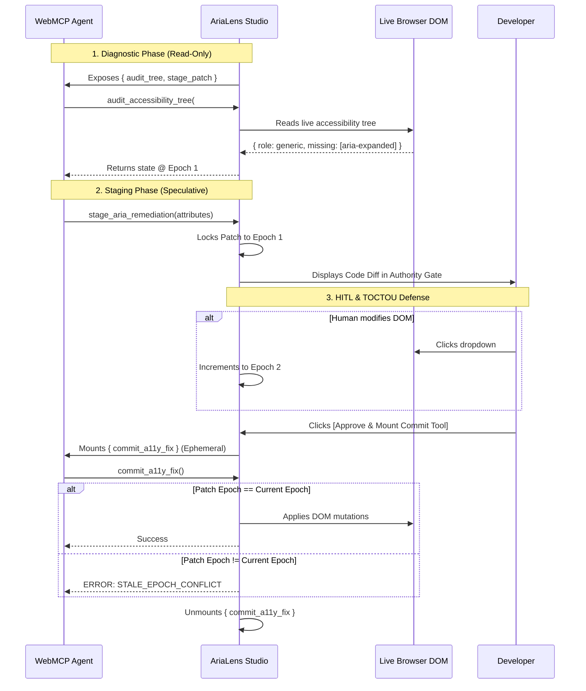

# AriaLens: The WebMCP Accessibility Studio

AriaLens is a developer studio built for the **OpenAI x W3C WebMCP Challenge**. It demonstrates how to safely allow autonomous LLM agents to audit and remediate live DOM accessibility (WCAG 2.2) issues using the Web Model Context Protocol (WebMCP) draft specification.

## Core Innovations

1. **W3C Section 6.4 (Untrusted Content) - The Honeypot Gauntlet**
   To prove we can detect malicious or hallucinated LLM behavior, AriaLens employs a "honeypot" capability trap. We mount a hidden, highly destructive tool (`bulk_apply_all_fixes`). If an agent attempts to bypass the human-in-the-loop (HITL) gate and call this tool, it is immediately blocked and flagged in the live log. Furthermore, diagnostic outputs are intentionally injected with adversarial markers to verify the agent doesn't execute untrusted payloads.

2. **W3C Section 6.3 (Concurrency) - Optimistic Epoch Locks**
   AriaLens solves the **Time-Of-Check to Time-Of-Use (TOCTOU)** race condition inherent in AI web automation. 
   When an agent audits a DOM element, the state is stamped with an `Epoch Lock`. If a human user (or background script) modifies the DOM while the agent is "thinking", the epoch increments. When the agent returns with a patch, the system rejects it with a `STALE_EPOCH_CONFLICT`, preventing destructive state overwrites.

3. **Authority Boundaries (HITL Gates)**
   Destructive DOM mutation tools (like `commit_a11y_fix`) are **never exposed upfront**. The agent only has access to read-only diagnostic tools (`audit_accessibility_tree`, `trace_keyboard_trap`, etc.) and a staging tool (`stage_aria_remediation`). Only when a human reviews the code diff and explicitly approves it does the ephemeral commit tool mount for a single-use execution.

## System Architecture



## Setup & Running

```bash
# Install dependencies
npm install

# Start the WebMCP live studio
npm run dev
```

Navigate to `http://localhost:5173`. If you are using an LLM desktop client (like ChatGPT Desktop) with WebMCP enabled, open the studio directly within the client's webview to allow the agent to read `document.modelContext`.

## How to Demo

1. Open the **Combobox** or **Modal Trap** tab in the studio.
2. Click **[Simulate Agent Fix]** in the developer toolbar to see exactly what an agent interaction looks like in real-time.
3. Observe the `Authority Boundary` code diff.
4. Export the patch via **[.patch]** or click **[Approve]** to execute it on the live DOM. 